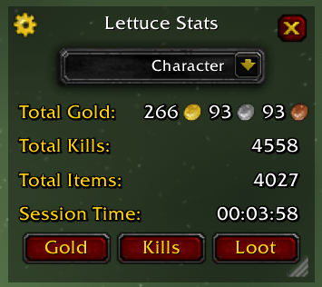
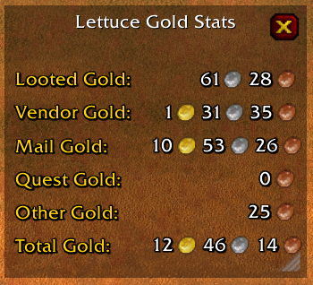
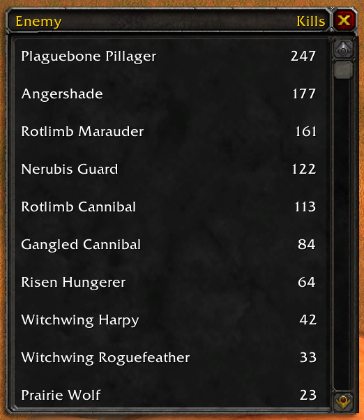
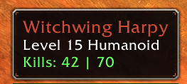
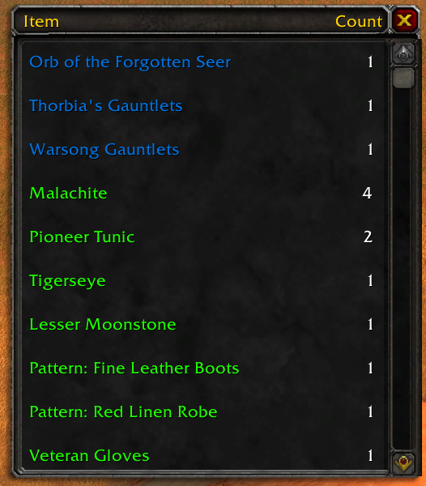
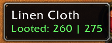
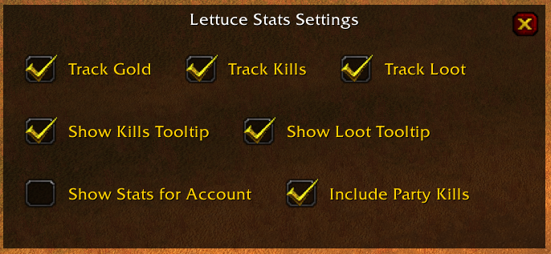

# LettuceTracker
A World of Warcraft Classic addon for tracking stats related to gold, kills and items. Extremely lightweight and minimalist compared to other tracking addons.

## Installation
Go to [the latest releases](https://github.com/TheKingOfLettuce/LettuceTracker/releases/latest) and download the `LettuceTracker-version.zip` in the Assets, and unzip the `LettuceTracker` folder into your addons location for World of Warcraft

## Quick Start
If addon is installed and enabled, you should see a message in chat saying `Lettuce Tracker Addon Loaded`.

### Main Window
To open the main window, enter a slash command in chat with `/lettucestats` or simply `/ls`. This will open the following window:

This show basic totals for all gold collected, total number of kills, total number of items collected, and the current session time. The dropdown at the top allows you to view stats for your current character, your entire account, or the current session. The 3 buttons on the bottom will open more detailed stat windows for each category 
The gear in the top left will open the addon settings

### Gold Window
To open this window, press the `Gold` button in the Main window.

This shows a breakdown of your total gold from the various sources that can be tracked reliably:
- Looted Gold
    - Any gold that you personally have looted
- Vendor Gold
    - Any gold made from selling items to a vendor
- Mail Gold
    - Any gold received from the mail, mainly for Auction House but also includes player sent mail
- Quest Gold
    - Any gold received from turning in a quest
- Other Gold
    - Any other source of gold that can't be reliably tracked, such as gold looted from a party member

### Kills Window
To open this window, press the `Kills` button in the Main window.

This shows a comprehensive list of every NPC you have slain (or your party has slain if enabled). Sorted by kill count, it simply lists the NPC name on the left and the kill count on the right 
There is also a tooltip on enemies that shows the kill count with `CharacterKillCount | AccountKillCount`

### Loot Window
To open this window, press the `Loot` button in the Main window.

This shows a comprehensive list of every item you have looted or received. First sorted by rarity, then by collect count, it simply lists the item name on the left and the collect count on the right 
There is also a tooltip on items that shows the collect count with `CharacterCollectCount | AccountCollectCount`

### Settings Window
To open this window, press the Gear icon on the top left in the Main window

There are the following settings:
- Track Gold
    - Enables the tracking of gold, and any related functionality to gold
- Track Kills
    - Enables the tracking of kills, and any related functionality to kills
- Track Loot
    - Enables the tracking of loot, and any related functionality to loot
- Show Kills Tooltip
    - Enables the tooltip that shows up on enemies to display the kill counts
- Show Loot Tooltip
    - Enables the tooltip that shows up on items to display the collect counts
- Include Party Kills
    - Enables the tracking of all kills in the party, not just personal or pet kills
